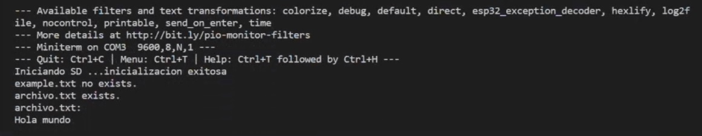

# PRACTICA 5: BUSES DE COMUNICACIÓN II

## INFORME EJERCICIO 1 LECTURA/ESCRITURA DE MEMORIA SD

### Salida por el puerto serie

A continuación podemos ver la salida por el puerto serie:

<!--Images-->

### Funcionamiento

Para empezar creamos un fichero myFile. Dentro del setup intentamos inicializar la SD, si la SD no se inicia saldra un mensaje de "No se pudo inicializar" de lo contrario el mensaje sera "inicialización exitosa". 
Seguidamente se comprueva si el fichero "archivo.txt" existe. Una vez comprovado lo asignamos a el fichero myFile, entonces si este se encuentra abierto y disponible escribiremos por el terminal el contenido que leemos de este, y luego cerramos el archivo. En el caso que el archivo no se abriera mostraria por pantalla " error al abrir el archivo". 
Por otro lado si el fichero archivo.txt no existiera en la SD lo que hariamos es crear-lo, escribir "Hola mundo" en el y seguidamente repetir los pasos que se ahn seguido en el caso donde el archivo ya existía.