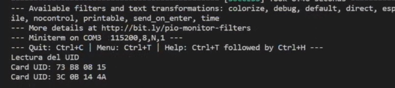

# PRACTICA 5: BUSES DE COMUNICACIÓN II

## INFORME EJERCICIO 2 LECTURA DE ETIQUETA RFID

### Salida por el puerto serie

<!--Images-->

### Funcionamiento

En el codigo primero de todo definimos los pines para el reset y el SS del RC522 y se crea un objeto MFRC522 para el RC522. En el setup iniciamos la comunicación serial, el bus SPI y el MFRC522. 
En el loop primero se revisa si hay trajetas nuevas presentes, en caso afirmativo se selecciona una tarjeta (si esta se puede leer) y se envia serialmente su UID, esto mostrara por pantalla "Card UID: " y el UID de la tarjeta en hexadecimal. Por ultimo se termina la lectura de esa tarjeta.